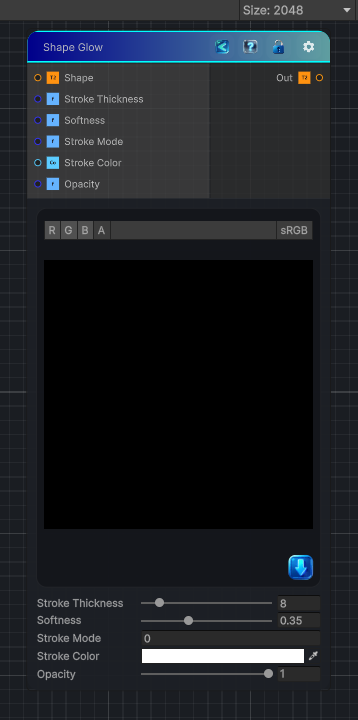

<link rel="stylesheet" href="../_assets/theme.css">

<button type="button" class="genesis-theme-toggle" data-genesis-theme-toggle aria-label="Toggle theme">Dark</button>

---
category: "Effects"
---

# Shape Stroke

> e deceptively simple nodes that actually does a very specific geometric operation:

## Description

e deceptively simple nodes that actually does a very specific geometric operation:
✔ It generates an outline around a binary shape
✔ The outline has a thickness
✔ It has softness (feathering)
✔ It supports inner, outer, or both stroke modes
✔ It is distance‑based, not blur‑based
To recreate this in Genesis CRT, we have:
- A distance check around the shape
- A stroke band (inner/outer)
- A soft falloff
- A color + opacity
- Fully deterministic, CRT‑safe sampling

## Inputs

| Name | Type | Description |
|------|------|-------------|
| Shape | Texture2D |  |
| Stroke Thickness | Single |  |
| Softness | Single |  |
| Stroke Mode | Single |  |
| Stroke Color | Color |  |
| Opacity | Single |  |

## Outputs

| Name | Type |
|------|------|
| Out | Texture2D |

## Parameters

| Setting | Type | Default | Description |
|---------|------|---------|-------------|
| Stroke Thickness | Range | 8 | Controls the stroke thickness. |
| Softness | Range | 0.35 | Controls the softness. |
| Stroke Mode | Int | 0 | Controls the stroke mode. |
| Stroke Color | Color | (1,1,1,1) | Controls the stroke color. |
| Opacity | Range | 1.0 | Controls the opacity. |

## See Also

- [Back to Shape Stroke](./effects-index.md)
