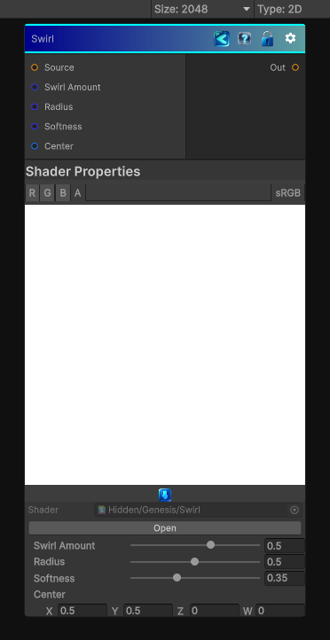

<link rel="stylesheet" href="../_assets/theme.css">

<button type="button" class="genesis-theme-toggle" data-genesis-theme-toggle aria-label="Toggle theme">Dark</button>

---
category: "Effects"
---

# Swirl

> Swirl node is one of those classic 2D deformation operators: a radial rotation field centered on the UV, with a falloff so pixels near the center rotate more than pixels near the edge.

## Description

Swirl node is one of those classic 2D deformation operators: a radial rotation field centered on the UV, with a falloff so pixels near the center rotate more than pixels near the edge.
✔ Centered swirl
✔ Angle amount
✔ Radius
✔ Soft falloff
✔ Bidirectional rotation (positive/negative)
✔ Deterministic, CRT‑safe sampling

## Inputs

| Name | Type | Description |
|------|------|-------------|

## Outputs

| Name | Type |
|------|------|

## Parameters

| Setting | Type | Default | Description |
|---------|------|---------|-------------|
| Swirl Amount | Range | 0.5       // turns (±2 = 720°) | Controls the swirl amount. |
| Radius | Range | 0.5              // normalized radius | Controls the radius. |
| Softness | Range | 0.35         // falloff shaping | Controls the softness. |
| Center | Vector | (0.5, 0.5, 0, 0)       // UV center | Controls the center. |

## See Also

- [Back to Swirl](./effects-index.md)
