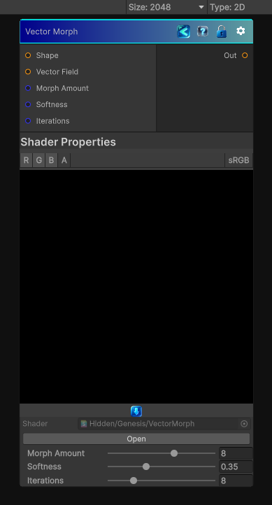

<link rel="stylesheet" href="../_assets/theme.css">

<button type="button" class="genesis-theme-toggle" data-genesis-theme-toggle aria-label="Toggle theme">Dark</button>

---
category: "Effects"
---

# Vector Morph

> Vector Morph is one of the most elegant shape‑processing nodes in the entire library. It takes a shape mask and a vector field, and it pushes the shape outward or inward according to that vector field — essentially a vector‑guided dilation/erosion.

## Description

 Vector Morph is one of the most elegant shape‑processing nodes in the entire library. It takes a shape mask and a vector field, and it pushes the shape outward or inward according to that vector field — essentially a vector‑guided dilation/erosion.
It’s not a warp.
It’s not a blur.
It’s not a directional transform.
It is a morphological expansion driven by a vector map.
It has:
- ✔ A vector map (RG = XY direction)
- ✔ A shape mask
- ✔ A morph amount
- ✔ A softness
- ✔ A distance‑based falloff
- ✔ Deterministic, CRT‑safe sampling

## Inputs

| Name | Type | Description |
|------|------|-------------|

## Outputs

| Name | Type |
|------|------|

## Parameters

| Setting | Type | Default | Description |
|---------|------|---------|-------------|
| Morph Amount | Range | 8 | Controls the morph amount. |
| Softness | Range | 0.35 | Controls the softness. |
| Iterations | Range | 8 | Controls the iterations. |

## See Also

- [Back to Vector Morph](./effects-index.md)
