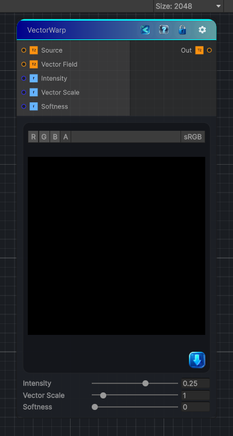

<link rel="stylesheet" href="../_assets/theme.css">

<button type="button" class="genesis-theme-toggle" data-genesis-theme-toggle aria-label="Toggle theme">Dark</button>

---
category: "Effects"
---

# Vector Warp

> Vector Warp is one of the cleanest and most useful deformation nodes in the whole library. Unlike Vector Morph (which grows the shape along a vector field), Vector Warp actually warps the UVs using a vector map.

## Description

Vector Warp is one of the cleanest and most useful deformation nodes in the whole library. Unlike Vector Morph (which grows the shape along a vector field), Vector Warp actually warps the UVs using a vector map.
Think of it as:
✔ A UV displacement
✔ Driven by a vector field (RG = XY)
✔ With intensity
✔ With scale
✔ With optional falloff
✔ Fully per‑pixel

## Inputs

| Name | Type | Description |
|------|------|-------------|
| Source | Texture2D |  |
| Vector Field | Texture2D |  |
| Intensity | Single |  |
| Vector Scale | Single |  |
| Softness | Single |  |

## Outputs

| Name | Type |
|------|------|
| Out | Texture2D |

## Parameters

| Setting | Type | Default | Description |
|---------|------|---------|-------------|
| Intensity | Range | 0.25 | Controls the intensity. |
| Vector Scale | Range | 1.0 | Controls the vector scale. |
| Softness | Range | 0.0 | Controls the softness. |

## See Also

- [Back to Vector Warp](./effects-index.md)
