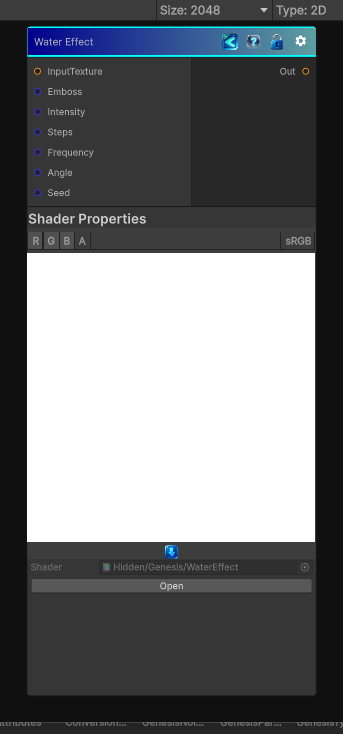

<link rel="stylesheet" href="../_assets/theme.css">

<button type="button" class="genesis-theme-toggle" data-genesis-theme-toggle aria-label="Toggle theme">Dark</button>

---
category: "Effects"
---

# Water Effect

> Applies the existing water ripple distortion shader as a surfaced Genesis node.

## Description

Applies the existing water ripple distortion shader as a surfaced Genesis node.

Use it for:
- Ripples and refractive wobble
- Heat-haze style distortion
- Stylized liquid surface motion

## Inputs

| Name | Type | Description |
|------|------|-------------|

## Outputs

| Name | Type |
|------|------|

## Parameters

| Setting | Type | Default | Description |
|---------|------|---------|-------------|
| Emboss | Range | 0.4 | The influence of the waves on the effect |
| Intensity | Range | 2.2 | Intensity simulates ripples on the waves |
| Steps | Range | 8 | More steps make the effect more complicated, as if it is coming from multiple directions |
| Frequency | Range | 6.0 | Frequency of the waves |
| Angle | float | 5 | Initial angle of the waves |
| Seed | float | 52.0 | Seed value |

## See Also

- [Back to Water Effect](./effects-index.md)
