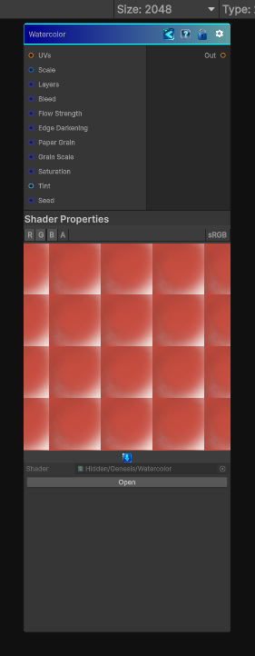

<link rel="stylesheet" href="../_assets/theme.css">

<button type="button" class="genesis-theme-toggle" data-genesis-theme-toggle aria-label="Toggle theme">Dark</button>

---
category: "Effects"
---

# Watercolor

> Scale controls blotch size. Use larger X/Y to stretch blotches.

## Description

Scale controls blotch size. Use larger X/Y to stretch blotches.
Layers increases richness and overlap; higher values are slower.
Bleed softens blotch edges and increases watercolor diffusion.
Flow creates directional streaking; combine with nonzero _Scale X/Y differences for directional brush effects.
EdgeDark strengthens wet edges and pigment pooling.
PaperGrain and GrainScale add realistic paper texture and granulation.

## Inputs

| Name | Type | Description |
|------|------|-------------|

## Outputs

| Name | Type |
|------|------|

## Parameters

| Setting | Type | Default | Description |
|---------|------|---------|-------------|
| Tiling Mode | Keyword Enum | 1 | Controls the tiling mode. |
| UV Mode | Enum | 0 | Controls the uv mode. |
| Scale | Vector | (4,4,0,0) | Controls the scale. |
| Layers | Int Range | 8 | Controls the layers. |
| Bleed | Range | 0.45 | Controls the bleed. |
| Flow Strength | Range | 0.35 | Controls the flow strength. |
| Edge Darkening | Range | 1.2 | Controls the edge darkening. |
| Paper Grain | Range | 0.25 | Controls the paper grain. |
| Grain Scale | Float | 120.0 | Controls the grain scale. |
| Saturation | Range | 1.1 | Controls the saturation. |
| Tint | Color | (0.6,0.2,0.15,1) | Controls the tint. |
| Seed | Int | 42 | Controls the seed. |

## See Also

- [Back to Watercolor](./effects-index.md)
