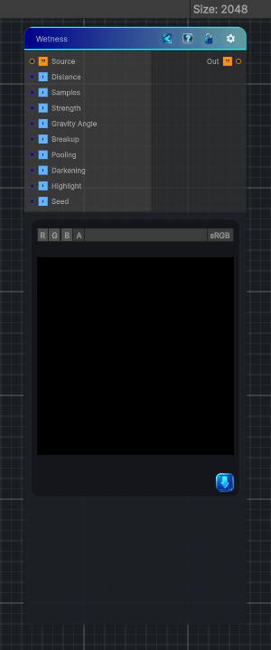

<link rel="stylesheet" href="../_assets/theme.css">

<button type="button" class="genesis-theme-toggle" data-genesis-theme-toggle aria-label="Toggle theme">Dark</button>

---
category: "Effects"
---

# Wetness

> Darkens and softens the source using a derived flow and pooling mask to suggest wet material.

## Description

Darkens and softens the source using a derived flow and pooling mask to suggest wet material.

This is a good fit for:
- Puddled surfaces
- Damp streaks
- Rain-darkened materials

## Inputs

| Name | Type | Description |
|------|------|-------------|
| Source | Texture2D |  |
| Distance | Single |  |
| Samples | Single |  |
| Strength | Single |  |
| Gravity Angle | Single |  |
| Breakup | Single |  |
| Pooling | Single |  |
| Darkening | Single |  |
| Highlight | Single |  |
| Seed | Single |  |

## Outputs

| Name | Type |
|------|------|
| Out | Texture2D |

## Parameters

| Setting | Type | Default | Description |
|---------|------|---------|-------------|
| Distance | Range | 18 | Controls the distance. |
| Samples | Range | 12 | Controls the samples. |
| Strength | Range | 1 | Controls the strength. |
| Gravity Angle | Range | -90 | Controls the gravity angle. |
| Breakup | Range | 0.35 | Controls the breakup. |
| Pooling | Range | 0.5 | Controls the pooling. |
| Darkening | Range | 0.2 | Controls the darkening. |
| Highlight | Range | 0.15 | Controls the highlight. |
| Seed | Float | 0 | Controls the seed. |
| Mode | Float | 0 | Controls the mode. |

## See Also

- [Back to Wetness](./effects-index.md)
