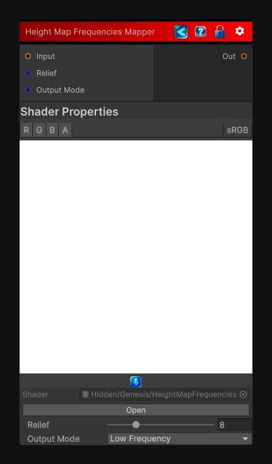

<link rel="stylesheet" href="../_assets/theme.css">

<button type="button" class="genesis-theme-toggle" data-genesis-theme-toggle aria-label="Toggle theme">Dark</button>

---
category: "Filters/Adjustments"
---

# Height Map Frequencies Mapper

> Separates a height map's frequencies into two distinct maps:

## Description

Separates a height map's frequencies into two distinct maps:
• Low Frequency  — large-scale displacement (blurred version of input)
• High Frequency — small-scale detail (original minus low-frequency, re-centered at 0.5)

Set Output Mode to select which signal this node outputs.
Relief controls how coarse the low-frequency blur is (0 = no separation, 32 = very coarse).
Use two instances to obtain both outputs simultaneously.

## Inputs

| Name | Type | Description |
|------|------|-------------|

## Outputs

| Name | Type |
|------|------|

## Parameters

| Setting | Type | Default | Description |
|---------|------|---------|-------------|
| Relief | Range | 8.0 | Controls the relief. |
| Output Mode | Keyword Enum | 0 | Controls the output mode. |

## See Also

- [Back to Height Map Frequencies Mapper](./filters-index.md)
