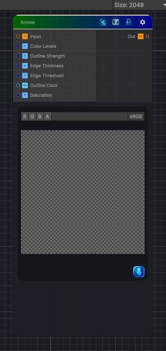

<link rel="stylesheet" href="../_assets/theme.css">

<button type="button" class="genesis-theme-toggle" data-genesis-theme-toggle aria-label="Toggle theme">Dark</button>

---
category: "Filters"
---

# Anime

> Applies an anime / cel-shading effect by posterizing colors and adding edge outlines.

## Description

Applies an anime / cel-shading effect by posterizing colors and adding edge outlines.

## Inputs

| Name | Type | Description |
|------|------|-------------|
| Input | Texture2D |  |
| Color Levels | Single | Number of color levels per channel. Lower is more posterized. |
| Outline Strength | Single | Strength of the edge outline overlay. 0 no outlines, 1 full. |
| Edge Thickness | Single | Thickness of the detected edges in pixels. |
| Edge Threshold | Single | How sensitive the edge detection is. Lower is more edges. |
| Outline Color | Color | Outline color. |
| Saturation | Single | Saturation boost. 1 original, 2 double. |

## Outputs

| Name | Type |
|------|------|
| Out | Texture2D |

## Parameters

| Setting | Type | Default | Description |
|---------|------|---------|-------------|
| Color Levels | Range | 6 | Number of color levels per channel. Lower is more posterized. |
| Outline Strength | Range | 0.6 | Strength of the edge outline overlay. 0 no outlines, 1 full. |
| Edge Thickness | Range | 1.5 | Thickness of the detected edges in pixels. |
| Edge Threshold | Range | 0.08 | How sensitive the edge detection is. Lower is more edges. |
| Outline Color | Color | (0, 0, 0, 1) | Outline color. |
| Saturation | Range | 1.3 | Saturation boost. 1 original, 2 double. |

## See Also

- [Back to Anime](./filters-index.md)
