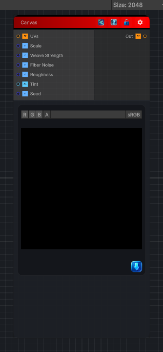

<link rel="stylesheet" href="../_assets/theme.css">

<button type="button" class="genesis-theme-toggle" data-genesis-theme-toggle aria-label="Toggle theme">Dark</button>

---
category: "Filters/Artistic"
---

# Canvas

> - Paper/canvas fiber grain

## Description

- Paper/canvas fiber grain
- Directional weave (warp/weft)
- Micro‑roughness
- Pigment catch (paint settling into fibers)
- Optional color tinting

## Inputs

| Name | Type | Description |
|------|------|-------------|
| UVs | Texture2D |  |
| Scale | Single |  |
| Weave Strength | Single |  |
| Fiber Noise | Single |  |
| Roughness | Single |  |
| Tint | Color |  |
| Seed | Single |  |

## Outputs

| Name | Type |
|------|------|
| Out | Texture2D |

## Parameters

| Setting | Type | Default | Description |
|---------|------|---------|-------------|
| Tiling Mode | Keyword Enum | 1 | Controls the tiling mode. |
| UV Mode | Enum | 0 | Controls the uv mode. |
| Scale | Float | 8.0 | Controls the scale. |
| Weave Strength | Range | 0.55 | Controls the weave strength. |
| Fiber Noise | Range | 0.35 | Controls the fiber noise. |
| Roughness | Range | 0.4 | Controls the roughness. |
| Tint | Color | (0.95,0.92,0.88,1) | Controls the tint. |
| Seed | Int | 42 | Controls the seed. |

## See Also

- [Back to Canvas](./filters-index.md)
