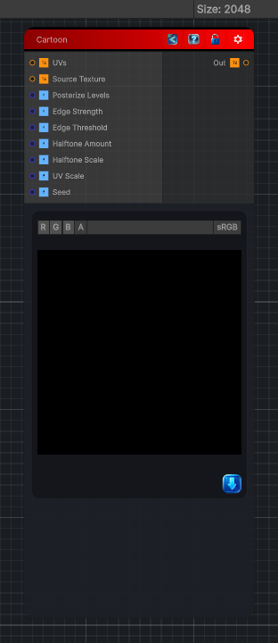

<link rel="stylesheet" href="../_assets/theme.css">

<button type="button" class="genesis-theme-toggle" data-genesis-theme-toggle aria-label="Toggle theme">Dark</button>

---
category: "Filters/Artistic"
---

# Cartoon

> - Edge detection (Sobel‑style)

## Description

- Edge detection (Sobel‑style)
- Color quantization (toon shading)
- Posterization
- Optional halftone dots

## Inputs

| Name | Type | Description |
|------|------|-------------|
| UVs | Texture2D |  |
| Source Texture | Texture2D |  |
| Posterize Levels | Single |  |
| Edge Strength | Single |  |
| Edge Threshold | Single |  |
| Halftone Amount | Single |  |
| Halftone Scale | Single |  |
| UV Scale | Single |  |
| Seed | Single |  |

## Outputs

| Name | Type |
|------|------|
| Out | Texture2D |

## Parameters

| Setting | Type | Default | Description |
|---------|------|---------|-------------|
| Source Texture | 2D | white | Controls the source texture. |
| Tiling Mode | Keyword Enum | 1 | Controls the tiling mode. |
| UV Mode | Enum | 0 | Controls the uv mode. |
| Posterize Levels | Range | 6 | Controls the posterize levels. |
| Edge Strength | Range | 2.0 | Controls the edge strength. |
| Edge Threshold | Range | 0.2 | Controls the edge threshold. |
| Halftone Amount | Range | 0.0 | Controls the halftone amount. |
| Halftone Scale | Float | 120.0 | Controls the halftone scale. |
| UV Scale | Float | 1.0 | Controls the uv scale. |
| Seed | Int | 42 | Controls the seed. |

## See Also

- [Back to Cartoon](./filters-index.md)
