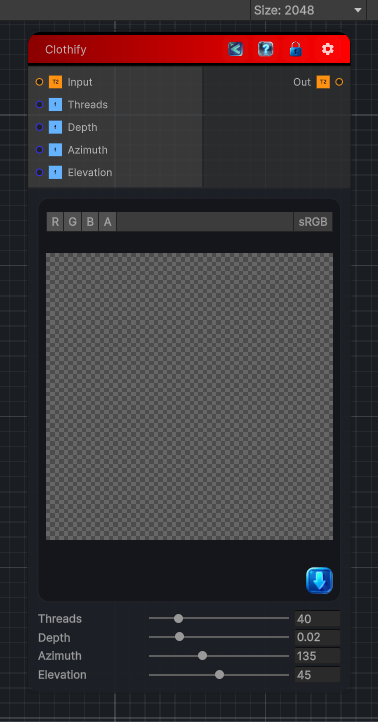

<link rel="stylesheet" href="../_assets/theme.css">

<button type="button" class="genesis-theme-toggle" data-genesis-theme-toggle aria-label="Toggle theme">Dark</button>

---
category: "Filters/Artistic"
---

# Clothify

> Clothify, like GIMP. Overlays a woven cloth texture and lights it, so the image appears printed on fabric. Threads is the weave density, Depth the bump strength of the weave, Azimuth and Elevation set the lighting direction that shades the warp and weft.

## Description

Clothify, like GIMP. Overlays a woven cloth texture and lights it, so the image appears printed on fabric. Threads is the weave density, Depth the bump strength of the weave, Azimuth and Elevation set the lighting direction that shades the warp and weft.

## Inputs

| Name | Type | Description |
|------|------|-------------|

## Outputs

| Name | Type |
|------|------|

## Parameters

| Setting | Type | Default | Description |
|---------|------|---------|-------------|
| Threads | Range | 40 | Controls the threads. |
| Depth | Range | 0.02 | Controls the depth. |
| Azimuth | Range | 135 | Controls the azimuth. |
| Elevation | Range | 45 | Controls the elevation. |

## See Also

- [Back to Clothify](./filters-index.md)
