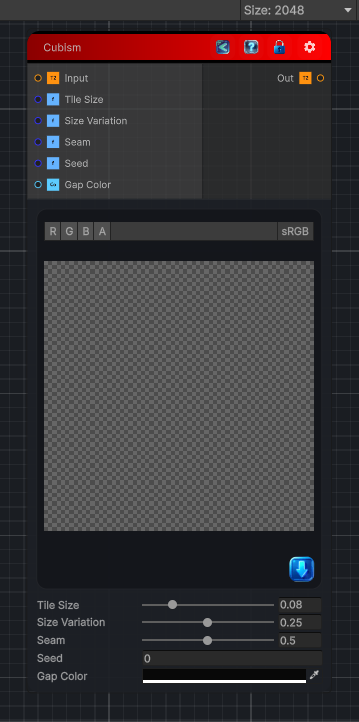

<link rel="stylesheet" href="../_assets/theme.css">

<button type="button" class="genesis-theme-toggle" data-genesis-theme-toggle aria-label="Toggle theme">Dark</button>

---
category: "Filters/Artistic"
---

# Cubism

> Cubism, like GIMP. Replaces the image with a collage of randomly sized, randomly rotated squares, each filled with a flat color sampled from where the square sits, leaving dark seams between them for a cubist block look. Tile Size is the cell grid size, Size Variation how much each square's size jitters, Seam how dark the gaps are, and Seed the random pattern.

## Description

Cubism, like GIMP. Replaces the image with a collage of randomly sized, randomly rotated squares, each filled with a flat color sampled from where the square sits, leaving dark seams between them for a cubist block look. Tile Size is the cell grid size, Size Variation how much each square's size jitters, Seam how dark the gaps are, and Seed the random pattern.

## Inputs

| Name | Type | Description |
|------|------|-------------|

## Outputs

| Name | Type |
|------|------|

## Parameters

| Setting | Type | Default | Description |
|---------|------|---------|-------------|
| Tile Size | Range | 0.08 | Controls the tile size. |
| Size Variation | Range | 0.25 | Controls the size variation. |
| Seam | Range | 0.5 | Controls the seam. |
| Seed | Float | 0 | Controls the seed. |
| Gap Color | Color | (0.03,0.03,0.03,1) | Controls the gap color. |

## See Also

- [Back to Cubism](./filters-index.md)
