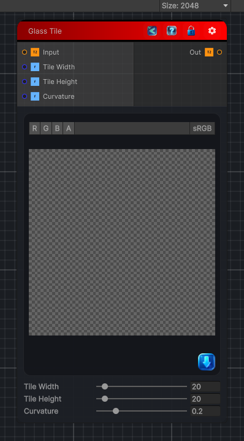

<link rel="stylesheet" href="../_assets/theme.css">

<button type="button" class="genesis-theme-toggle" data-genesis-theme-toggle aria-label="Toggle theme">Dark</button>

---
category: "Filters/Artistic"
---

# Glass Tile

> Glass Tile, like GIMP. Divides the image into tiles that act like little lenses, refracting the underlying pixels so the picture looks like it is behind a wall of glass blocks. Tile Width and Tile Height set the block size, Curvature the refraction strength.

## Description

Glass Tile, like GIMP. Divides the image into tiles that act like little lenses, refracting the underlying pixels so the picture looks like it is behind a wall of glass blocks. Tile Width and Tile Height set the block size, Curvature the refraction strength.

## Inputs

| Name | Type | Description |
|------|------|-------------|

## Outputs

| Name | Type |
|------|------|

## Parameters

| Setting | Type | Default | Description |
|---------|------|---------|-------------|
| Tile Width | Range | 20 | Controls the tile width. |
| Tile Height | Range | 20 | Controls the tile height. |
| Curvature | Range | 0.2 | Controls the curvature. |

## See Also

- [Back to Glass Tile](./filters-index.md)
