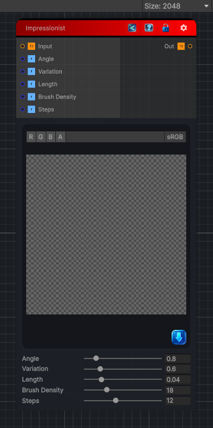

<link rel="stylesheet" href="../_assets/theme.css">

<button type="button" class="genesis-theme-toggle" data-genesis-theme-toggle aria-label="Toggle theme">Dark</button>

---
category: "Filters/Artistic"
---

# Impressionist

> Impressionist, like GIMP. Smears the image into painterly brush strokes that follow a per-brush direction. Angle is the base stroke direction, Variation how much each brush rotates from it, Length the smear length, Brush Density the number of brush cells, and Steps the sampling quality along each stroke.

## Description

Impressionist, like GIMP. Smears the image into painterly brush strokes that follow a per-brush direction. Angle is the base stroke direction, Variation how much each brush rotates from it, Length the smear length, Brush Density the number of brush cells, and Steps the sampling quality along each stroke.

## Inputs

| Name | Type | Description |
|------|------|-------------|
| Input | Texture2D |  |
| Angle | Single |  |
| Variation | Single |  |
| Length | Single |  |
| Brush Density | Single |  |
| Steps | Single |  |

## Outputs

| Name | Type |
|------|------|
| Out | Texture2D |

## Parameters

| Setting | Type | Default | Description |
|---------|------|---------|-------------|
| Angle | Range | 0.8 | Controls the angle. |
| Variation | Range | 0.6 | Controls the variation. |
| Length | Range | 0.04 | Controls the length. |
| Brush Density | Range | 18 | Controls the brush density. |
| Steps | Range | 12 | Controls the steps. |

## See Also

- [Back to Impressionist](./filters-index.md)
