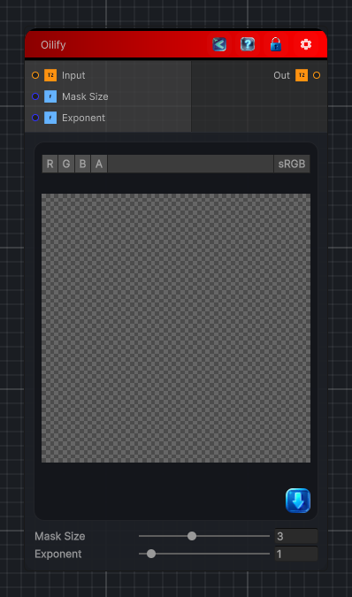

<link rel="stylesheet" href="../_assets/theme.css">

<button type="button" class="genesis-theme-toggle" data-genesis-theme-toggle aria-label="Toggle theme">Dark</button>

---
category: "Filters/Artistic"
---

# Oilify

> Oilify, like GIMP. Simulates an oil painting by replacing each pixel with the most frequent colour in its neighbourhood (a mode filter over a coarse colour histogram), giving smooth painterly regions. Mask Size is the neighbourhood radius, Exponent weights the histogram (higher favours the single dominant colour). Note: the input name is Oilify (GIMP spelling).

## Description

Oilify, like GIMP. Simulates an oil painting by replacing each pixel with the most frequent colour in its neighbourhood (a mode filter over a coarse colour histogram), giving smooth painterly regions. Mask Size is the neighbourhood radius, Exponent weights the histogram (higher favours the single dominant colour). Note: the input name is Oilify (GIMP spelling).

## Inputs

| Name | Type | Description |
|------|------|-------------|
| Input | Texture2D |  |
| Mask Size | Single |  |
| Exponent | Single |  |

## Outputs

| Name | Type |
|------|------|
| Out | Texture2D |

## Parameters

| Setting | Type | Default | Description |
|---------|------|---------|-------------|
| Mask Size | Range | 3 | Controls the mask size. |
| Exponent | Range | 1 | Controls the exponent. |

## See Also

- [Back to Oilify](./filters-index.md)
