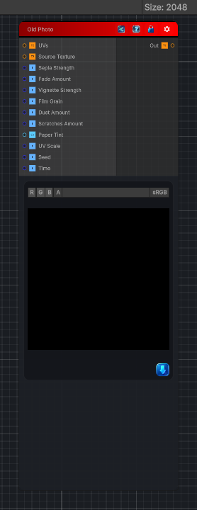

<link rel="stylesheet" href="../_assets/theme.css">

<button type="button" class="genesis-theme-toggle" data-genesis-theme-toggle aria-label="Toggle theme">Dark</button>

---
category: "Filters/Artistic"
---

# Old Photo

> - Sepia toning

## Description

- Sepia toning
- Film fade & contrast loss
- Paper yellowing
- Vignette darkening
- Film grain
- Dust & scratches
- Edge wear

## Inputs

| Name | Type | Description |
|------|------|-------------|
| UVs | Texture2D |  |
| Source Texture | Texture2D |  |
| Sepia Strength | Single |  |
| Fade Amount | Single |  |
| Vignette Strength | Single |  |
| Film Grain | Single |  |
| Dust Amount | Single |  |
| Scratches Amount | Single |  |
| Paper Tint | Color |  |
| UV Scale | Single |  |
| Seed | Single |  |
| Time | Single |  |

## Outputs

| Name | Type |
|------|------|
| Out | Texture2D |

## Parameters

| Setting | Type | Default | Description |
|---------|------|---------|-------------|
| Source Texture | 2D | white | Controls the source texture. |
| Tiling Mode | Keyword Enum | 1 | Controls the tiling mode. |
| UV Mode | Enum | 0 | Controls the uv mode. |
| Sepia Strength | Range | 0.8 | Controls the sepia strength. |
| Fade Amount | Range | 0.4 | Controls the fade amount. |
| Vignette Strength | Range | 1.2 | Controls the vignette strength. |
| Film Grain | Range | 0.35 | Controls the film grain. |
| Dust Amount | Range | 0.25 | Controls the dust amount. |
| Scratches Amount | Range | 0.3 | Controls the scratches amount. |
| Paper Tint | Color | (0.95,0.88,0.75,1) | Controls the paper tint. |
| UV Scale | Float | 1.0 | Controls the uv scale. |
| Seed | Int | 42 | Controls the seed. |
| Time | Float | 0 | Controls the time. |

## See Also

- [Back to Old Photo](./filters-index.md)
