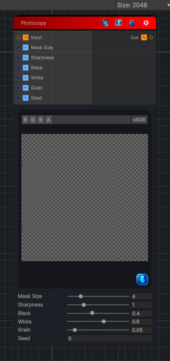

<link rel="stylesheet" href="../_assets/theme.css">

<button type="button" class="genesis-theme-toggle" data-genesis-theme-toggle aria-label="Toggle theme">Dark</button>

---
category: "Filters/Artistic"
---

# Photocopy

> Photocopy, like GIMP. Turns the image into a stark high-contrast black-and-white toner copy: it lifts the luminance with a soft mask, sharpens it, thresholds it to black/white and adds toner grain. Mask Size is the soft-mask radius, Sharpness the contrast, Black and White the thresholds, Grain the toner noise.

## Description

Photocopy, like GIMP. Turns the image into a stark high-contrast black-and-white toner copy: it lifts the luminance with a soft mask, sharpens it, thresholds it to black/white and adds toner grain. Mask Size is the soft-mask radius, Sharpness the contrast, Black and White the thresholds, Grain the toner noise.

## Inputs

| Name | Type | Description |
|------|------|-------------|
| Input | Texture2D |  |
| Mask Size | Single |  |
| Sharpness | Single |  |
| Black | Single |  |
| White | Single |  |
| Grain | Single |  |
| Seed | Single |  |

## Outputs

| Name | Type |
|------|------|
| Out | Texture2D |

## Parameters

| Setting | Type | Default | Description |
|---------|------|---------|-------------|
| Mask Size | Range | 4 | Controls the mask size. |
| Sharpness | Range | 1 | Controls the sharpness. |
| Black | Range | 0.4 | Controls the black. |
| White | Range | 0.6 | Controls the white. |
| Grain | Range | 0.05 | Controls the grain. |
| Seed | Float | 0 | Controls the seed. |

## See Also

- [Back to Photocopy](./filters-index.md)
