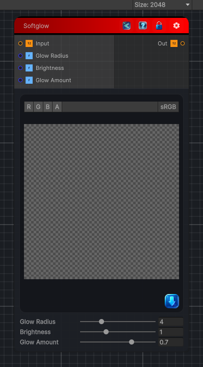

<link rel="stylesheet" href="../_assets/theme.css">

<button type="button" class="genesis-theme-toggle" data-genesis-theme-toggle aria-label="Toggle theme">Dark</button>

---
category: "Filters/Artistic"
---

# Softglow

> Softglow, like GIMP. Adds a soft warm glow by brightening the image, blurring the brightened copy, and screen-blending it back over the original. Glow Radius is the blur size, Brightness how much the glow source is boosted, and Glow Amount how much of the glow is blended in.

## Description

Softglow, like GIMP. Adds a soft warm glow by brightening the image, blurring the brightened copy, and screen-blending it back over the original. Glow Radius is the blur size, Brightness how much the glow source is boosted, and Glow Amount how much of the glow is blended in.

## Inputs

| Name | Type | Description |
|------|------|-------------|

## Outputs

| Name | Type |
|------|------|

## Parameters

| Setting | Type | Default | Description |
|---------|------|---------|-------------|
| Glow Radius | Range | 4 | Controls the glow radius. |
| Brightness | Range | 1 | Controls the brightness. |
| Glow Amount | Range | 0.7 | Controls the glow amount. |

## See Also

- [Back to Softglow](./filters-index.md)
