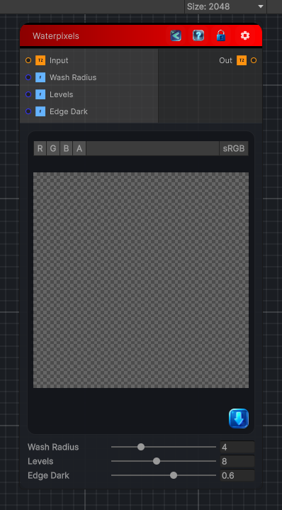

<link rel="stylesheet" href="../_assets/theme.css">

<button type="button" class="genesis-theme-toggle" data-genesis-theme-toggle aria-label="Toggle theme">Dark</button>

---
category: "Filters/Artistic"
---

# Waterpixels

> Waterpixels, like GIMP. A watercolour wash: the image is heavily smoothed into soft colour regions, posterized into discrete pools of colour, then the edges where the wash differs from the original are darkened for a painted, watery look. Wash Radius is the smoothing size, Levels the colour posterization count, and Edge Dark the strength of the dark edges.

## Description

Waterpixels, like GIMP. A watercolour wash: the image is heavily smoothed into soft colour regions, posterized into discrete pools of colour, then the edges where the wash differs from the original are darkened for a painted, watery look. Wash Radius is the smoothing size, Levels the colour posterization count, and Edge Dark the strength of the dark edges.

## Inputs

| Name | Type | Description |
|------|------|-------------|

## Outputs

| Name | Type |
|------|------|

## Parameters

| Setting | Type | Default | Description |
|---------|------|---------|-------------|
| Wash Radius | Range | 4 | Controls the wash radius. |
| Levels | Range | 8 | Controls the levels. |
| Edge Dark | Range | 0.6 | Controls the edge dark. |

## See Also

- [Back to Waterpixels](./filters-index.md)
