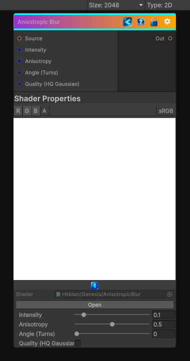

<link rel="stylesheet" href="../_assets/theme.css">

<button type="button" class="genesis-theme-toggle" data-genesis-theme-toggle aria-label="Toggle theme">Dark</button>

---
category: "Filters/Blur"
---

# Anisotropic Blur

> Performs a high-quality directional blur, matching Substance 3D Designer's Anisotropic Blur.

## Description

Performs a high-quality directional blur, matching Substance 3D Designer's Anisotropic Blur.

Parameters:
• Intensity (0–1)   — Overall blur radius. Higher values spread the blur further.
• Anisotropy (0–1)  — Directionality. 0 = isotropic (uniform in all directions).
                       1 = fully directional (motion-blur streak along Angle).
• Angle (0–1 turns) — Direction of the blur streak (0.5 = 180°, 1.0 = 360°/0°).
• Quality (toggle)  — Off = fast box blur. On = Gaussian (higher quality, smoother falloff).

## Inputs

| Name | Type | Description |
|------|------|-------------|

## Outputs

| Name | Type |
|------|------|

## Parameters

| Setting | Type | Default | Description |
|---------|------|---------|-------------|
| Intensity | Range | 0.1 | Controls the intensity. |
| Anisotropy | Range | 0.5 | Controls the anisotropy. |
| Angle (Turns) | Range | 0.0 | Controls the angle (turns). |
| Quality (HQ Gaussian) | Toggle | 0 | Controls the quality (hq gaussian). |

## See Also

- [Back to Anisotropic Blur](./filters-index.md)
