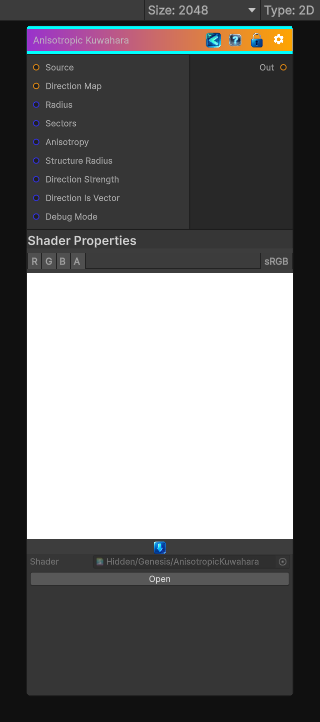

<link rel="stylesheet" href="../_assets/theme.css">

<button type="button" class="genesis-theme-toggle" data-genesis-theme-toggle aria-label="Toggle theme">Dark</button>

---
category: "Filters/Blur"
---

# Anisotropic Kuwahara

> Blur the input texture using a box blur.

## Description

Blur the input texture using a box blur.

## Inputs

| Name | Type | Description |
|------|------|-------------|

## Outputs

| Name | Type |
|------|------|

## Parameters

| Setting | Type | Default | Description |
|---------|------|---------|-------------|
| Radius | Range | 4 | Controls the radius. |
| Sectors | Range | 8 | Controls the sectors. |
| Anisotropy | Range | 2 | Controls the anisotropy. |
| Structure Radius | Range | 2 | Controls the structure radius. |
| Direction Strength | Range | 1 | Controls the direction strength. |
| Direction Is Vector | Int | 0 | Controls the direction is vector. |
| Debug Mode | Int | 0 | Controls the debug mode. |

## See Also

- [Back to Anisotropic Kuwahara](./filters-index.md)
