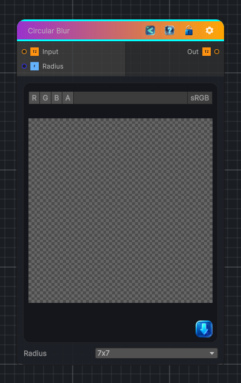

<link rel="stylesheet" href="../_assets/theme.css">

<button type="button" class="genesis-theme-toggle" data-genesis-theme-toggle aria-label="Toggle theme">Dark</button>

---
category: "Filters/Blur"
---

# Circular Blur

> Circular (disk) blur. Averages every sample that falls inside a circular kernel of the given radius, producing circular bokeh-style softening without the square corners of a box blur.

## Description

Circular (disk) blur. Averages every sample that falls inside a circular kernel of the given radius, producing circular bokeh-style softening without the square corners of a box blur.

## Inputs

| Name | Type | Description |
|------|------|-------------|

## Outputs

| Name | Type |
|------|------|

## Parameters

| Setting | Type | Default | Description |
|---------|------|---------|-------------|
| Radius | int | 3 | Controls the radius. |

## See Also

- [Back to Circular Blur](./filters-index.md)
