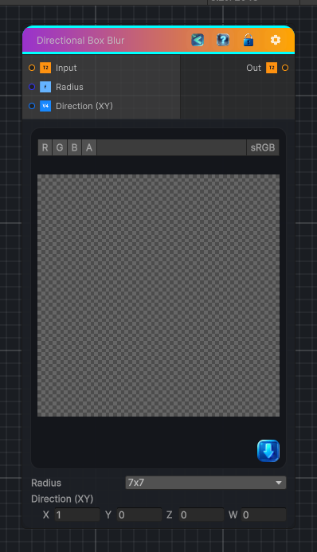

<link rel="stylesheet" href="../_assets/theme.css">

<button type="button" class="genesis-theme-toggle" data-genesis-theme-toggle aria-label="Toggle theme">Dark</button>

---
category: "Filters/Blur"
---

# Directional Box Blur

> Blur the input texture using a Box Blur filter in the specified direction.

## Description

Blur the input texture using a Box Blur filter in the specified direction.

## Inputs

| Name | Type | Description |
|------|------|-------------|
| Input | Texture2D |  |
| Radius | Single |  |
| Direction (XY) | Vector4 |  |

## Outputs

| Name | Type |
|------|------|
| Out | Texture2D |

## Parameters

| Setting | Type | Default | Description |
|---------|------|---------|-------------|
| Radius | int | 3 | Controls the radius. |
| Direction (XY) | Vector | (1,0,0,0) | Controls the direction (xy). |

## See Also

- [Back to Directional Box Blur](./filters-index.md)
