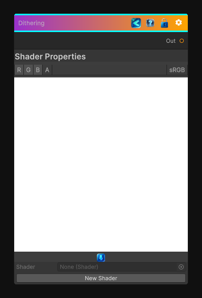

<link rel="stylesheet" href="../_assets/theme.css">

<button type="button" class="genesis-theme-toggle" data-genesis-theme-toggle aria-label="Toggle theme">Dark</button>

---
category: "Filters/Blur"
---

# Dithering

> Dithering with an algorithm selection:

## Description

Dithering with an algorithm selection:
Equidistant Sampling
2x2 Ordered dithering offsets
2 step random dithering offsets
Random offset per pixel

## Inputs

| Name | Type | Description |
|------|------|-------------|

## Outputs

| Name | Type |
|------|------|

## Parameters

| Setting | Type | Default | Description |
|---------|------|---------|-------------|
| Dithering Algorithm | Enum | 1 | Dithering algorithm |
| Samples | int | 3 | Number of samples, higher is more expensive |
| Seed | Float | 52 | Seed for randomness |

## See Also

- [Back to Dithering](./filters-index.md)
