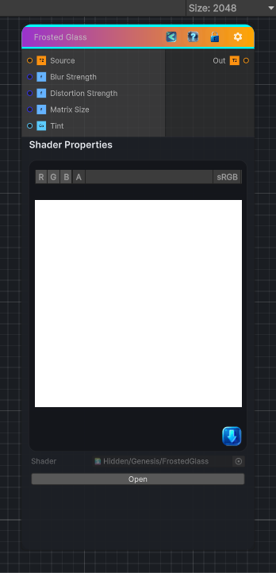

<link rel="stylesheet" href="../_assets/theme.css">

<button type="button" class="genesis-theme-toggle" data-genesis-theme-toggle aria-label="Toggle theme">Dark</button>

---
category: "Filters/Blur"
---

# Frosted Glass

> A frosted glass style effect

## Description

A frosted glass style effect

## Inputs

| Name | Type | Description |
|------|------|-------------|
| Source | Texture2D | Source Texture |
| Blur Strength | Single | Tooltip(Strength of the blur |
| Distortion Strength | Single | Influence of distortion |
| Matrix Size | Single | Blur matrix size |
| Tint | Color | Added Tint Color, set alpha to 0.0 to disable |

## Outputs

| Name | Type |
|------|------|
| Out | Texture2D |

## Parameters

| Setting | Type | Default | Description |
|---------|------|---------|-------------|
| Blur Strength | Float | 1.0 | Controls the blur strength. |
| Distortion Strength | Float | 0.05 | Influence of distortion |
| Matrix Size | int | 3 | Blur matrix size |
| Tint | Color | (1,1,1,0.0) | Added Tint Color, set alpha to 0.0 to disable |

## See Also

- [Back to Frosted Glass](./filters-index.md)
