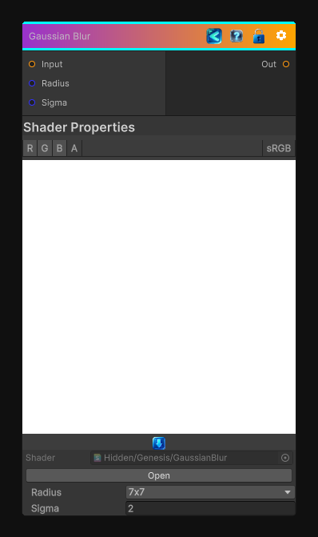

<link rel="stylesheet" href="../_assets/theme.css">

<button type="button" class="genesis-theme-toggle" data-genesis-theme-toggle aria-label="Toggle theme">Dark</button>

---
category: "Filters/Blur"
---

# Gaussian Blur

> Multi-Kernel size Gaussian blur

## Description

Multi-Kernel size Gaussian blur

## Inputs

| Name | Type | Description |
|------|------|-------------|

## Outputs

| Name | Type |
|------|------|

## Parameters

| Setting | Type | Default | Description |
|---------|------|---------|-------------|
| Radius | int | 3 | Controls the radius. |
| Sigma | Float | 2.0 | Controls the sigma. |

## See Also

- [Back to Gaussian Blur](./filters-index.md)
