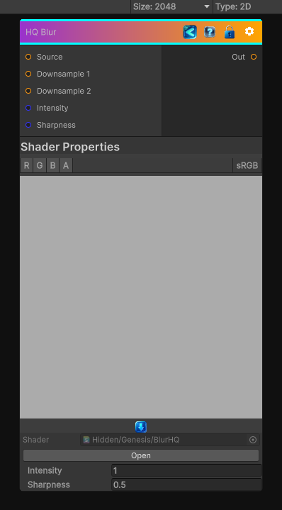

<link rel="stylesheet" href="../_assets/theme.css">

<button type="button" class="genesis-theme-toggle" data-genesis-theme-toggle aria-label="Toggle theme">Dark</button>

---
category: "Filters/Blur"
---

# HQ Blur

> High quality blur

## Description

High quality blur
Downsample → blur → upsample → blend

Produces large‑radius, smooth, artifact‑free blur

Matches Substance’s Blur HQ behavior

Works for grayscale and color

## Inputs

| Name | Type | Description |
|------|------|-------------|

## Outputs

| Name | Type |
|------|------|

## Parameters

| Setting | Type | Default | Description |
|---------|------|---------|-------------|
| Source | 2D | white | Original input |
| Downsample 1 | 2D | gray | Downsample x2 input |
| Downsample 2 | 2D | gray | Downsample x4 input |
| Intensity | Float | 1.0 | Blend strength of HQ blur |
| Sharpness | Float | 0.5 | Sharpness of upsample blending |

## See Also

- [Back to HQ Blur](./filters-index.md)
