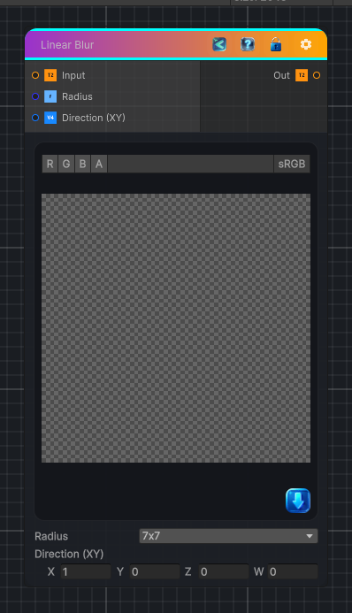

<link rel="stylesheet" href="../_assets/theme.css">

<button type="button" class="genesis-theme-toggle" data-genesis-theme-toggle aria-label="Toggle theme">Dark</button>

---
category: "Filters/Blur"
---

# Linear Blur

> Linear blur. A 1D line-kernel blur: it averages samples spread evenly along a direction vector with uniform (linear) weighting, producing a straight motion-style streak. This is the line-segment companion to the circular (disk) blur. Alpha is taken from the input and is not blurred.

## Description

Linear blur. A 1D line-kernel blur: it averages samples spread evenly along a direction vector with uniform (linear) weighting, producing a straight motion-style streak. This is the line-segment companion to the circular (disk) blur. Alpha is taken from the input and is not blurred.

## Inputs

| Name | Type | Description |
|------|------|-------------|

## Outputs

| Name | Type |
|------|------|

## Parameters

| Setting | Type | Default | Description |
|---------|------|---------|-------------|
| Radius | int | 3 | Controls the radius. |
| Direction (XY) | Vector | (1,0,0,0) | Controls the direction (xy). |

## See Also

- [Back to Linear Blur](./filters-index.md)
