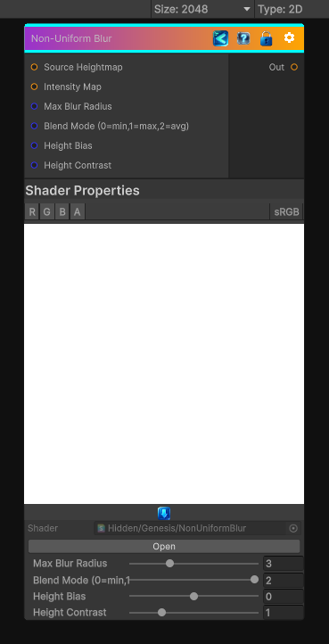

<link rel="stylesheet" href="../_assets/theme.css">

<button type="button" class="genesis-theme-toggle" data-genesis-theme-toggle aria-label="Toggle theme">Dark</button>

---
category: "Filters/Blur"
---

# Non-Uniform Blur

> Non-Uniform blur where blur radius is determined by the intensity map

## Description

Non-Uniform blur where blur radius is determined by the intensity map

## Inputs

| Name | Type | Description |
|------|------|-------------|

## Outputs

| Name | Type |
|------|------|

## Parameters

| Setting | Type | Default | Description |
|---------|------|---------|-------------|
| Source Heightmap | 2D | white | Controls the source heightmap. |
| Intensity Map | 2D | gray | Controls the intensity map. |
| Max Blur Radius | Range | 3.0 | Controls the max blur radius. |
| Blend Mode (0=min,1=max,2=avg) | Range | 2 | Controls the blend mode (0=min,1=max,2=avg). |
| Height Bias | Range | 0.0 | Controls the height bias. |
| Height Contrast | Range | 1.0 | Controls the height contrast. |

## See Also

- [Back to Non-Uniform Blur](./filters-index.md)
