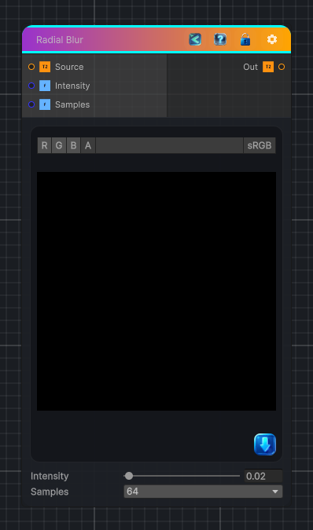

<link rel="stylesheet" href="../_assets/theme.css">

<button type="button" class="genesis-theme-toggle" data-genesis-theme-toggle aria-label="Toggle theme">Dark</button>

---
category: "Filters/Blur"
---

# Radial Blur

> Radial Blur

## Description

Radial Blur

## Inputs

| Name | Type | Description |
|------|------|-------------|
| Source | Texture2D | Source Texture |
| Intensity | Single | Blur intensity |
| Samples | Single | Number of blur samples, higher is slower |

## Outputs

| Name | Type |
|------|------|
| Out | Texture2D |

## Parameters

| Setting | Type | Default | Description |
|---------|------|---------|-------------|
| Intensity | Range | 0.02 | Blur intensity |
| Samples | Float | 5 | Number of blur samples, higher is slower |

## See Also

- [Back to Radial Blur](./filters-index.md)
