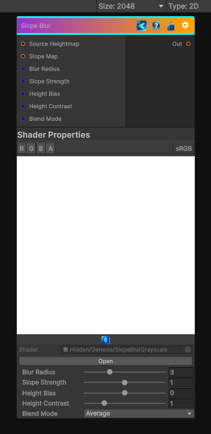

<link rel="stylesheet" href="../_assets/theme.css">

<button type="button" class="genesis-theme-toggle" data-genesis-theme-toggle aria-label="Toggle theme">Dark</button>

---
category: "Filters/Blur"
---

# Slope Blur

> Directional blur with the direction given as the slope of a grayscale input

## Description

Directional blur with the direction given as the slope of a grayscale input

## Inputs

| Name | Type | Description |
|------|------|-------------|

## Outputs

| Name | Type |
|------|------|

## Parameters

| Setting | Type | Default | Description |
|---------|------|---------|-------------|
| Source Heightmap | 2D | white | Controls the source heightmap. |
| Slope Map | 2D | gray | Controls the slope map. |
| Blur Radius | Range | 3.0 | Controls the blur radius. |
| Slope Strength | Range | 1.0 | Controls the slope strength. |
| Height Bias | Range | 0.0 | Controls the height bias. |
| Height Contrast | Range | 1.0 | Controls the height contrast. |
| Blend Mode | Float | 2 | Controls the blend mode. |

## See Also

- [Back to Slope Blur](./filters-index.md)
