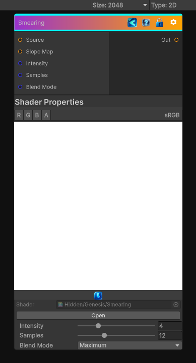

<link rel="stylesheet" href="../_assets/theme.css">

<button type="button" class="genesis-theme-toggle" data-genesis-theme-toggle aria-label="Toggle theme">Dark</button>

---
category: "Filters/Blur"
---

# Smearing

> Substance-style smearing driven by a grayscale slope map.

## Description

Substance-style smearing driven by a grayscale slope map.

The filter traces samples along the local slope direction and combines them with the selected mode:
- Maximum smears bright detail outward
- Minimum smears dark detail outward
- Average produces a softer blur-like trail

Useful for:
- Pulled paint and clay streaks
- Dragged dirt and rust masks
- Height-based chipping and directional breakup

## Inputs

| Name | Type | Description |
|------|------|-------------|
| Source | Texture2D |  |
| Slope Map | Texture2D |  |
| Intensity | Single |  |
| Samples | Single |  |
| Blend Mode | Single |  |

## Outputs

| Name | Type |
|------|------|
| Out | Texture2D |

## Parameters

| Setting | Type | Default | Description |
|---------|------|---------|-------------|
| Intensity | Range | 4 | Controls the intensity. |
| Samples | Int Range | 12 | Controls the samples. |
| Blend Mode | Float | 1 | Controls the blend mode. |

## See Also

- [Back to Smearing](./filters-index.md)
