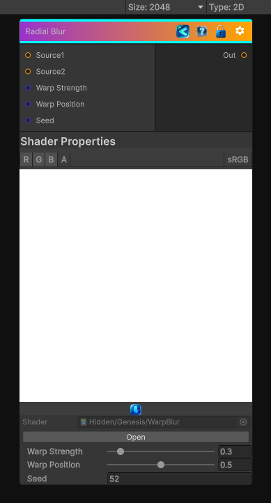

<link rel="stylesheet" href="../_assets/theme.css">

<button type="button" class="genesis-theme-toggle" data-genesis-theme-toggle aria-label="Toggle theme">Dark</button>

---
category: "Filters/Blur"
---

# Warp Blur

> A warp like blur between 2 input textures.

## Description

A warp like blur between 2 input textures.

## Inputs

| Name | Type | Description |
|------|------|-------------|

## Outputs

| Name | Type |
|------|------|

## Parameters

| Setting | Type | Default | Description |
|---------|------|---------|-------------|
| Warp Strength | Range | 0.3 | Strength |
| Warp Position | Range | 0.5 | Position of warp.  0 is fully source 1.  1 is fully source 2 |
| Seed | int | 52 | Seed of randomness |

## See Also

- [Back to Warp Blur](./filters-index.md)
