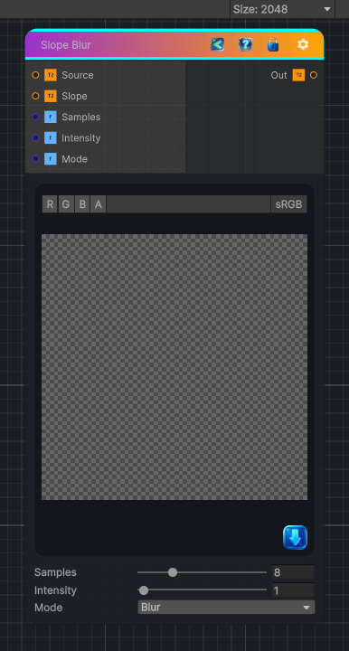

<link rel="stylesheet" href="../_assets/theme.css">

<button type="button" class="genesis-theme-toggle" data-genesis-theme-toggle aria-label="Toggle theme">Dark</button>

---
category: "Filters/Blurs"
---

# Slope Blur

> Performs a high-quality directional blur driven by the gradients of a grayscale slope map.

## Description

Performs a high-quality directional blur driven by the gradients of a grayscale slope map.

Inputs:
- Source: The color or grayscale texture to blur.
- Slope: A grayscale height map whose slopes control the blur direction.

Parameters:
- Samples: Quality of the blur from 0 to 32 samples.
- Intensity: Blur strength from 0 to 64.
- Mode: Blur averages samples, Min erodes bright regions, and Max expands them.

## Inputs

| Name | Type | Description |
|------|------|-------------|

## Outputs

| Name | Type |
|------|------|

## Parameters

| Setting | Type | Default | Description |
|---------|------|---------|-------------|
| Source | 2D | white | Controls the source. |
| Slope | 2D | gray | Controls the slope. |
| Samples | Int Range | 8 | Controls the samples. |
| Intensity | Range | 1 | Controls the intensity. |
| Mode | Enum | 0 | Controls the mode. |

## See Also

- [Back to Slope Blur](./filters-index.md)
