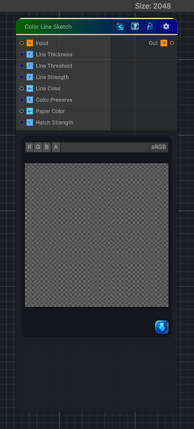

<link rel="stylesheet" href="../_assets/theme.css">

<button type="button" class="genesis-theme-toggle" data-genesis-theme-toggle aria-label="Toggle theme">Dark</button>

---
category: "Filters"
---

# Color Line Sketch

> Creates a colored line-sketch effect by overlaying detected edges onto the original colors.

## Description

Creates a colored line-sketch effect by overlaying detected edges onto the original colors.

## Inputs

| Name | Type | Description |
|------|------|-------------|
| Input | Texture2D |  |
| Line Thickness | Single | Thickness of the sketch lines in pixels. |
| Line Threshold | Single | How sensitive the line detection is. Lower more lines. |
| Line Strength | Single | Strength of the line overlay. 0 no lines, 1 full lines. |
| Line Color | Color | Color of the sketch lines. |
| Color Preserve | Single | How much of the original color to preserve. 0 paper white, 1 full color. |
| Paper Color | Color | Background paper color. |
| Hatch Strength | Single | Adds a slight crosshatch texture to the sketch. |

## Outputs

| Name | Type |
|------|------|
| Out | Texture2D |

## Parameters

| Setting | Type | Default | Description |
|---------|------|---------|-------------|
| Line Thickness | Range | 1.5 | Thickness of the sketch lines in pixels. |
| Line Threshold | Range | 0.07 | How sensitive the line detection is. Lower more lines. |
| Line Strength | Range | 0.8 | Strength of the line overlay. 0 no lines, 1 full lines. |
| Line Color | Color | (0.1, 0.1, 0.1, 1) | Color of the sketch lines. |
| Color Preserve | Range | 0.7 | How much of the original color to preserve. 0 paper white, 1 full color. |
| Paper Color | Color | (0.95, 0.93, 0.88, 1) | Background paper color. |
| Hatch Strength | Range | 0.15 | Adds a slight crosshatch texture to the sketch. |

## See Also

- [Back to Color Line Sketch](./filters-index.md)
