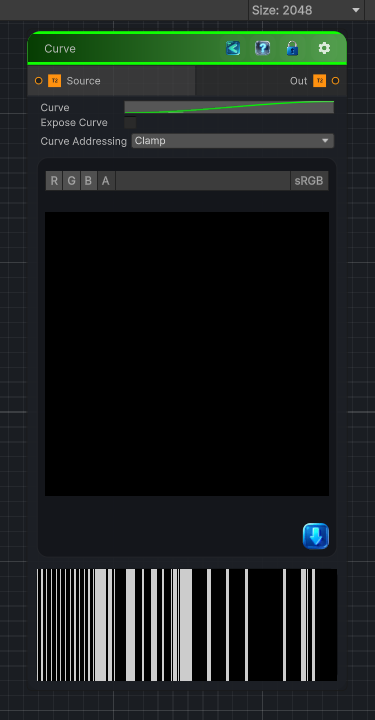

<link rel="stylesheet" href="../_assets/theme.css">

<button type="button" class="genesis-theme-toggle" data-genesis-theme-toggle aria-label="Toggle theme">Dark</button>

---
category: "Filters"
---

# Curve

> Remaps each input pixel's tonal value through a custom Bezier curve. Color inputs are

## Description

Remaps each input pixel's tonal value through a custom Bezier curve. Color inputs are
evaluated per RGB channel and alpha is preserved. Expose Curve outputs the curve as a
grayscale lookup gradient. Curve Addressing controls whether HDR values outside 0-1 are
clamped or folded back into range.

## Inputs

| Name | Type | Description |
|------|------|-------------|
| Source | Texture2D |  |

## Outputs

| Name | Type |
|------|------|
| Out | Texture2D |

## Parameters

| Setting | Type | Default | Description |
|---------|------|---------|-------------|
| Curve Texture | 2D | white | Controls the curve texture. |
| Expose Curve | Float | 0 | Controls the expose curve. |
| Curve Addressing | Float | 0 | Controls the curve addressing. |
| Key Count | Float | 0 | Controls the key count. |
| Positions | Vector | (0, 0, 0, 0) | Controls the positions. |
| Values | Vector | (0, 0, 0, 0) | Controls the values. |
| Smooth | Float | 0 | Controls the smooth. |

## See Also

- [Back to Curve](./filters-index.md)
