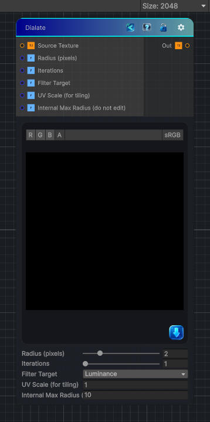

<link rel="stylesheet" href="../_assets/theme.css">

<button type="button" class="genesis-theme-toggle" data-genesis-theme-toggle aria-label="Toggle theme">Dark</button>

---
category: "Filters"
---

# Dialate

> performs morphological dilation on a feature mask derived from the source texture. It supports binary dilation (thresholded luminance) and grayscale dilation (max filter on luminance), iterative dilation (multiple passes), and a simple color expansion strategy that expands feature colors into the dilated region

## Description

performs morphological dilation on a feature mask derived from the source texture. It supports binary dilation (thresholded luminance) and grayscale dilation (max filter on luminance), iterative dilation (multiple passes), and a simple color expansion strategy that expands feature colors into the dilated region

## Inputs

| Name | Type | Description |
|------|------|-------------|

## Outputs

| Name | Type |
|------|------|

## Parameters

| Setting | Type | Default | Description |
|---------|------|---------|-------------|
| nodeVariables | VariableStorage | AhahGames.GenesisNoise.Graph.VariableStorage | |
| GUID | String | 8ce0a610-3a97-4027-adcf-48f90ef6e242 | |
| expanded | Boolean | False | |

## See Also

- [Back to Dialate](./filters-index.md)
