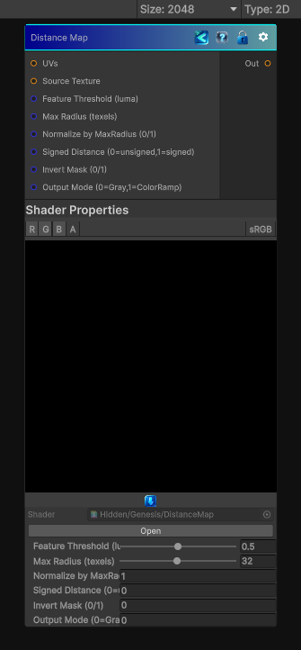

<link rel="stylesheet" href="../_assets/theme.css">

<button type="button" class="genesis-theme-toggle" data-genesis-theme-toggle aria-label="Toggle theme">Dark</button>

---
category: "Filters"
---

# Distance Map

> computes an approximate distance map from a binary feature mask derived from the source texture. It scans a circular neighborhood up to _MaxRadius texels and returns the minimum Euclidean distance to the nearest feature pixel. Options let you output normalized distance, pixel distance, or a signed distance (inside/outside).

## Description

computes an approximate distance map from a binary feature mask derived from the source texture. It scans a circular neighborhood up to _MaxRadius texels and returns the minimum Euclidean distance to the nearest feature pixel. Options let you output normalized distance, pixel distance, or a signed distance (inside/outside). 

## Inputs

| Name | Type | Description |
|------|------|-------------|

## Outputs

| Name | Type |
|------|------|

## Parameters

| Setting | Type | Default | Description |
|---------|------|---------|-------------|
| Source Texture | 2D | white | Controls the source texture. |
| Feature Threshold (luma) | Range | 0.5 | Controls the feature threshold (luma). |
| Max Radius (texels) | Range | 32 | Controls the max radius (texels). |
| Normalize by MaxRadius (0/1) | Float | 1 | Controls the normalize by maxradius (0/1). |
| Signed Distance (0=unsigned,1=signed) | Float | 0 | Controls the signed distance (0=unsigned,1=signed). |
| Invert Mask (0/1) | Float | 0 | Controls the invert mask (0/1). |
| Output Mode (0=Gray,1=ColorRamp) | Float | 0 | Controls the output mode (0=gray,1=colorramp). |

## See Also

- [Back to Distance Map](./filters-index.md)
