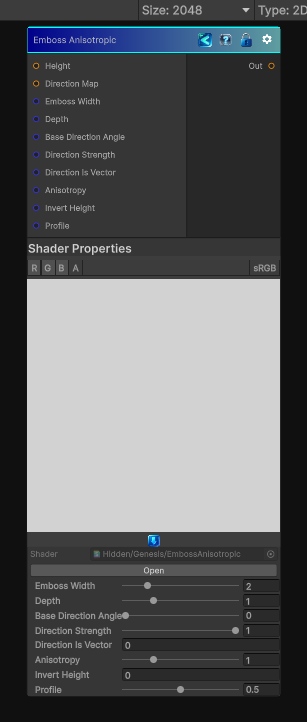

<link rel="stylesheet" href="../_assets/theme.css">

<button type="button" class="genesis-theme-toggle" data-genesis-theme-toggle aria-label="Toggle theme">Dark</button>

---
category: "Filters/Distort"
---

# Emboss Anisotropic

> ✔ Emboss direction guided by a direction map

## Description

✔ Emboss direction guided by a direction map
✔ Optional structure‑tensor anisotropy (auto‑flow)
✔ Height‑based embossing
✔ Width, depth, profile shaping
✔ Direction strength blending

## Inputs

| Name | Type | Description |
|------|------|-------------|

## Outputs

| Name | Type |
|------|------|

## Parameters

| Setting | Type | Default | Description |
|---------|------|---------|-------------|
| Emboss Width | Range | 2 | Controls the emboss width. |
| Depth | Range | 1 | Controls the depth. |
| Base Direction Angle | Range | 0.0 | Controls the base direction angle. |
| Direction Strength | Range | 1 | Controls the direction strength. |
| Direction Is Vector | Int | 0 | Controls the direction is vector. |
| Anisotropy | Range | 1 | Controls the anisotropy. |
| Invert Height | Int | 0 | Controls the invert height. |
| Profile | Range | 0.5 | Controls the profile. |

## See Also

- [Back to Emboss Anisotropic](./filters-index.md)
