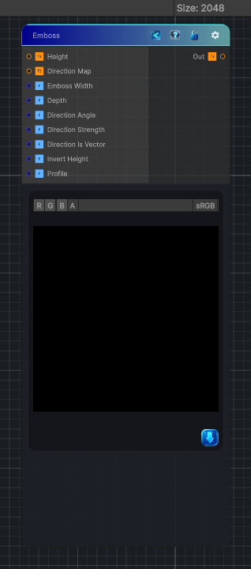

<link rel="stylesheet" href="../_assets/theme.css">

<button type="button" class="genesis-theme-toggle" data-genesis-theme-toggle aria-label="Toggle theme">Dark</button>

---
category: "Filters/Distort"
---

# Emboss

> • 	A height‑based normal offset

## Description

• 	A height‑based normal offset
• 	Applied in a user‑defined direction
• 	With positive/negative embossing
• 	And a soft profile that blends between bump‑map‑like and relief‑map‑like shading

## Inputs

| Name | Type | Description |
|------|------|-------------|
| Height | Texture2D |  |
| Direction Map | Texture2D |  |
| Emboss Width | Single |  |
| Depth | Single |  |
| Direction Angle | Single |  |
| Direction Strength | Single |  |
| Direction Is Vector | Single |  |
| Invert Height | Single |  |
| Profile | Single |  |

## Outputs

| Name | Type |
|------|------|
| Out | Texture2D |

## Parameters

| Setting | Type | Default | Description |
|---------|------|---------|-------------|
| Emboss Width | Range | 2 | Controls the emboss width. |
| Depth | Range | 1 | Controls the depth. |
| Direction Angle | Range | 0.0 | Controls the direction angle. |
| Direction Strength | Range | 1 | Controls the direction strength. |
| Direction Is Vector | Int | 0 | Controls the direction is vector. |
| Invert Height | Int | 0 | Controls the invert height. |
| Profile | Range | 0.5 | Controls the profile. |

## See Also

- [Back to Emboss](./filters-index.md)
