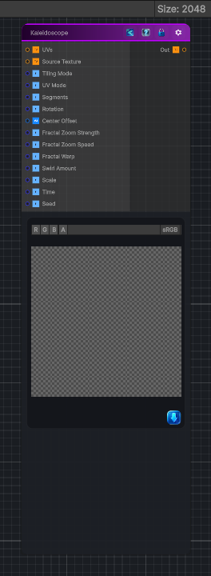

<link rel="stylesheet" href="../_assets/theme.css">

<button type="button" class="genesis-theme-toggle" data-genesis-theme-toggle aria-label="Toggle theme">Dark</button>

---
category: "Filters/Distort"
---

# Kaleidoscope

> - Performs angular kaleidoscope folding

## Description

- Performs angular kaleidoscope folding
- Applies radial fractal zooming (Mandelbrot‑style smooth zoom)
- Supports 2D / 3D / Cube UV modes
- Has rotation, zoom speed, swirl, center offset, segment count, and fractal warp
- Works with any input texture (or procedural source upstream)

## Inputs

| Name | Type | Description |
|------|------|-------------|
| UVs | Texture2D |  |
| Source Texture | Texture2D |  |
| Tiling Mode | Single |  |
| UV Mode | Single |  |
| Segments | Single |  |
| Rotation | Single |  |
| Center Offset | Vector4 |  |
| Fractal Zoom Strength | Single |  |
| Fractal Zoom Speed | Single |  |
| Fractal Warp | Single |  |
| Swirl Amount | Single |  |
| Scale | Single |  |
| Time | Single |  |
| Seed | Single |  |

## Outputs

| Name | Type |
|------|------|
| Out | Texture2D |

## Parameters

| Setting | Type | Default | Description |
|---------|------|---------|-------------|
| Source Texture | 2D | white | Controls the source texture. |
| Tiling Mode | Keyword Enum | 1 | Controls the tiling mode. |
| UV Mode | Enum | 0 | Controls the uv mode. |
| Segments | Range | 6 | Controls the segments. |
| Rotation | Range | 0 | Controls the rotation. |
| Center Offset | Vector | (0.5,0.5,0,0) | Controls the center offset. |
| Fractal Zoom Strength | Range | 0.8 | Controls the fractal zoom strength. |
| Fractal Zoom Speed | Float | 0.4 | Controls the fractal zoom speed. |
| Fractal Warp | Range | 0.3 | Controls the fractal warp. |
| Swirl Amount | Range | 0.2 | Controls the swirl amount. |
| Scale | Float | 1.0 | Controls the scale. |
| Time | Float | 0 | Controls the time. |
| Seed | Int | 42 | Controls the seed. |

## See Also

- [Back to Kaleidoscope](./filters-index.md)
