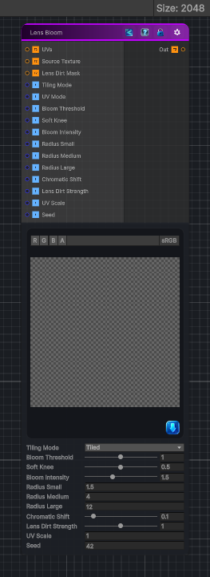

<link rel="stylesheet" href="../_assets/theme.css">

<button type="button" class="genesis-theme-toggle" data-genesis-theme-toggle aria-label="Toggle theme">Dark</button>

---
category: "Filters/Distort"
---

# Lens Bloom

> - Soft, cinematic bloom

## Description

- Soft, cinematic bloom
- Thresholded bright-pass
- Multi-radius Gaussian glow
- Chromatic fringing
- Lens dirt scattering
- Physically-inspired bloom rolloff

## Inputs

| Name | Type | Description |
|------|------|-------------|
| UVs | Texture2D |  |
| Source Texture | Texture2D |  |
| Lens Dirt Mask | Texture2D |  |
| Tiling Mode | Single |  |
| UV Mode | Single |  |
| Bloom Threshold | Single |  |
| Soft Knee | Single |  |
| Bloom Intensity | Single |  |
| Radius Small | Single |  |
| Radius Medium | Single |  |
| Radius Large | Single |  |
| Chromatic Shift | Single |  |
| Lens Dirt Strength | Single |  |
| UV Scale | Single |  |
| Seed | Single |  |

## Outputs

| Name | Type |
|------|------|
| Out | Texture2D |

## Parameters

| Setting | Type | Default | Description |
|---------|------|---------|-------------|
| Source Texture | 2D | white | Controls the source texture. |
| Lens Dirt Mask | 2D | white | Controls the lens dirt mask. |
| Tiling Mode | Keyword Enum | 1 | Controls the tiling mode. |
| UV Mode | Enum | 0 | Controls the uv mode. |
| Bloom Threshold | Range | 1.0 | Controls the bloom threshold. |
| Soft Knee | Range | 0.5 | Controls the soft knee. |
| Bloom Intensity | Range | 1.5 | Controls the bloom intensity. |
| Radius Small | Float | 1.5 | Controls the radius small. |
| Radius Medium | Float | 4.0 | Controls the radius medium. |
| Radius Large | Float | 12.0 | Controls the radius large. |
| Chromatic Shift | Range | 0.1 | Controls the chromatic shift. |
| Lens Dirt Strength | Range | 1.0 | Controls the lens dirt strength. |
| UV Scale | Float | 1.0 | Controls the uv scale. |
| Seed | Int | 42 | Controls the seed. |

## See Also

- [Back to Lens Bloom](./filters-index.md)
