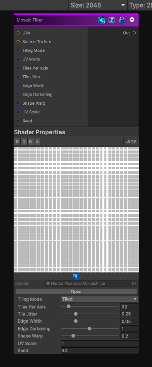

<link rel="stylesheet" href="../_assets/theme.css">

<button type="button" class="genesis-theme-toggle" data-genesis-theme-toggle aria-label="Toggle theme">Dark</button>

---
category: "Filters/Distort"
---

# Mosaic Filter

> Pixelates the input into square tiles

## Description

Pixelates the input into square tiles
Adds per‑tile jitter for organic variation
Adds tile shape warp for a hand‑drawn look
Adds edge darkening for stained‑glass / mosaic grout
Fully procedural and deterministic

## Inputs

| Name | Type | Description |
|------|------|-------------|

## Outputs

| Name | Type |
|------|------|

## Parameters

| Setting | Type | Default | Description |
|---------|------|---------|-------------|
| Source Texture | 2D | white | Controls the source texture. |
| Tiling Mode | Keyword Enum | 1 | Controls the tiling mode. |
| UV Mode | Enum | 0 | Controls the uv mode. |
| Tiles Per Axis | Range | 32 | Controls the tiles per axis. |
| Tile Jitter | Range | 0.25 | Controls the tile jitter. |
| Edge Width | Range | 0.05 | Controls the edge width. |
| Edge Darkening | Range | 1.0 | Controls the edge darkening. |
| Shape Warp | Range | 0.2 | Controls the shape warp. |
| UV Scale | Float | 1.0 | Controls the uv scale. |
| Seed | Int | 42 | Controls the seed. |

## See Also

- [Back to Mosaic Filter](./filters-index.md)
