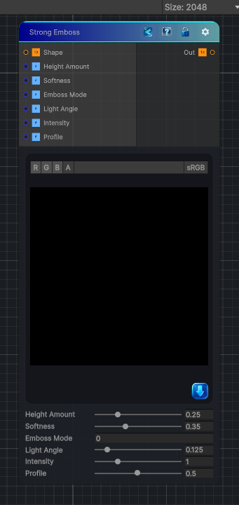

<link rel="stylesheet" href="../_assets/theme.css">

<button type="button" class="genesis-theme-toggle" data-genesis-theme-toggle aria-label="Toggle theme">Dark</button>

---
category: "Filters/Distort"
---

# Strong Emboss

> Strong Emboss is one of the most feature‑rich shape‑to‑height operators in the entire library. It’s basically a unified emboss engine that blends:

## Description

Strong Emboss is one of the most feature‑rich shape‑to‑height operators in the entire library. It’s basically a unified emboss engine that blends:
- Bevel
- Emboss
- Inner/Outer height offsets
- Softness
- Height profile shaping
- Light direction
- Intensity
- Distance‑based falloff
To recreate this in Genesis CRT, we need to build a height‑from‑shape gradient solver with:
✔ Normal‑style gradient from the shape mask
✔ Light direction
✔ Height profile curve
✔ Inner/outer emboss
✔ Softness (feathering)
✔ Intensity
✔ Deterministic, CRT‑safe sampling

## Inputs

| Name | Type | Description |
|------|------|-------------|
| Shape | Texture2D |  |
| Height Amount | Single |  |
| Softness | Single |  |
| Emboss Mode | Single |  |
| Light Angle | Single |  |
| Intensity | Single |  |
| Profile | Single |  |

## Outputs

| Name | Type |
|------|------|
| Out | Texture2D |

## Parameters

| Setting | Type | Default | Description |
|---------|------|---------|-------------|
| Height Amount | Range | 0.25 | Controls the height amount. |
| Softness | Range | 0.35 | Controls the softness. |
| Emboss Mode | Int | 0 | Controls the emboss mode. |
| Light Angle | Range | 0.125 | Controls the light angle. |
| Intensity | Range | 1.0 | Controls the intensity. |
| Profile | Range | 0.5 | Controls the profile. |

## See Also

- [Back to Strong Emboss](./filters-index.md)
