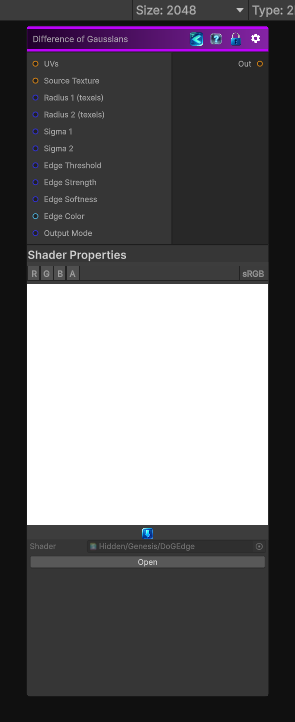

<link rel="stylesheet" href="../_assets/theme.css">

<button type="button" class="genesis-theme-toggle" data-genesis-theme-toggle aria-label="Toggle theme">Dark</button>

---
category: "Filters/Edge Detect"
---

# Difference of Gaussians

> computes a Difference of Gaussians (DoG) edge response. It performs two small separable Gaussian-like blurs at different radii, subtracts them to produce band-pass edges, applies thresholding and optional softening, and can output an edge mask, overlay edges on the source, or show edges only.

## Description

computes a Difference of Gaussians (DoG) edge response. It performs two small separable Gaussian-like blurs at different radii, subtracts them to produce band-pass edges, applies thresholding and optional softening, and can output an edge mask, overlay edges on the source, or show edges only.

## Inputs

| Name | Type | Description |
|------|------|-------------|

## Outputs

| Name | Type |
|------|------|

## Parameters

| Setting | Type | Default | Description |
|---------|------|---------|-------------|
| Source Texture | 2D | white | Controls the source texture. |
| Radius 1 (texels) | Range | 1 | Controls the radius 1 (texels). |
| Radius 2 (texels) | Range | 3 | Controls the radius 2 (texels). |
| Sigma 1 | Range | 1.0 | Controls the sigma 1. |
| Sigma 2 | Range | 2.5 | Controls the sigma 2. |
| Edge Threshold | Range | 0.05 | Controls the edge threshold. |
| Edge Strength | Range | 4.0 | Controls the edge strength. |
| Edge Softness | Range | 0.2 | Controls the edge softness. |
| Edge Color | Color | (0,0,0,1) | Controls the edge color. |
| Output Mode | Enum | 1   // 0 = Mask, 1 = Overlay, 2 = Edges Only | Controls the output mode. |

## See Also

- [Back to Difference of Gaussians](./filters-index.md)
