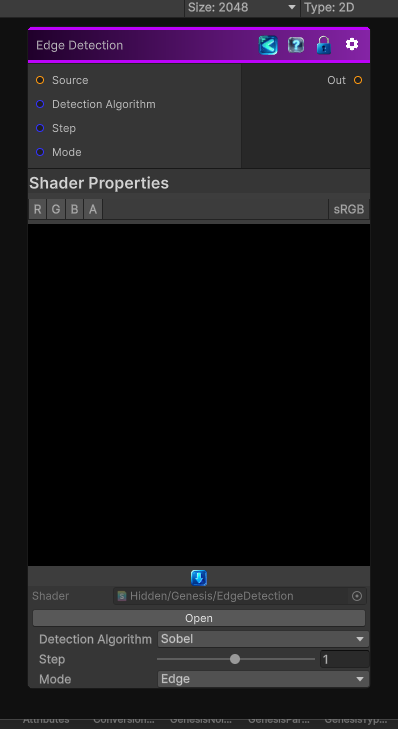

<link rel="stylesheet" href="../_assets/theme.css">

<button type="button" class="genesis-theme-toggle" data-genesis-theme-toggle aria-label="Toggle theme">Dark</button>

---
category: "Filters/Edge Detect"
---

# Edge Detection

> Edge detection using one of a few different algorithms

## Description

Edge detection using one of a few different algorithms

## Inputs

| Name | Type | Description |
|------|------|-------------|

## Outputs

| Name | Type |
|------|------|

## Parameters

| Setting | Type | Default | Description |
|---------|------|---------|-------------|
| Detection Algorithm | Enum | 0 | Algorithm to use for edge detection |
| Step | Range | 1 | Controls the step. |
| Mode | Enum | 0 | Output color mode, it can either be white and black or input texture coor |

## See Also

- [Back to Edge Detection](./filters-index.md)
