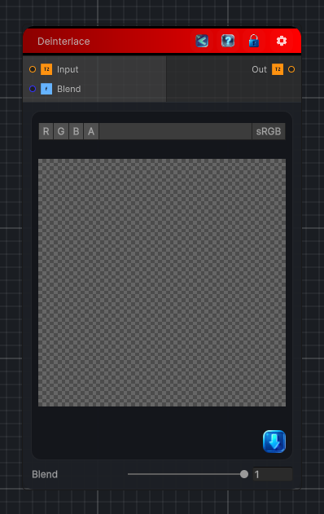

<link rel="stylesheet" href="../_assets/theme.css">

<button type="button" class="genesis-theme-toggle" data-genesis-theme-toggle aria-label="Toggle theme">Dark</button>

---
category: "Filters/Enhance"
---

# Deinterlace

> Deinterlace filter. Removes interlace combing by blending each scanline with the average of its two vertical neighbours (one texel above and below). The Blend amount controls how much of the neighbour average replaces the original line, from passthrough (0) to full deinterlace (1). Alpha is taken from the input and is not blended.

## Description

Deinterlace filter. Removes interlace combing by blending each scanline with the average of its two vertical neighbours (one texel above and below). The Blend amount controls how much of the neighbour average replaces the original line, from passthrough (0) to full deinterlace (1). Alpha is taken from the input and is not blended.

## Inputs

| Name | Type | Description |
|------|------|-------------|
| Input | Texture2D |  |
| Blend | Single |  |

## Outputs

| Name | Type |
|------|------|
| Out | Texture2D |

## Parameters

| Setting | Type | Default | Description |
|---------|------|---------|-------------|
| Blend | Range | 1 | Controls the blend. |

## See Also

- [Back to Deinterlace](./filters-index.md)
