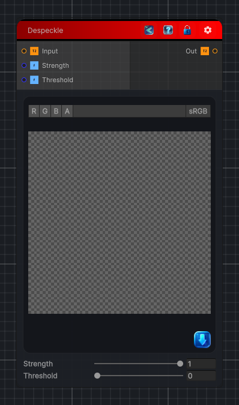

<link rel="stylesheet" href="../_assets/theme.css">

<button type="button" class="genesis-theme-toggle" data-genesis-theme-toggle aria-label="Toggle theme">Dark</button>

---
category: "Filters/Enhance"
---

# Despeckle

> Despeckle filter using a 3x3 per-channel median. Each pixel is replaced by the median of its eight neighbours plus itself, computed independently for R, G and B, which removes isolated speckle (impulse) noise while keeping edges far better than a blur. Strength blends toward the median. Threshold makes it speckle-only: pixels that already match their local median (difference below the threshold) are left untouched, so clean detail is preserved. Alpha is taken from the input and is not modified.

## Description

Despeckle filter using a 3x3 per-channel median. Each pixel is replaced by the median of its eight neighbours plus itself, computed independently for R, G and B, which removes isolated speckle (impulse) noise while keeping edges far better than a blur. Strength blends toward the median. Threshold makes it speckle-only: pixels that already match their local median (difference below the threshold) are left untouched, so clean detail is preserved. Alpha is taken from the input and is not modified.

## Inputs

| Name | Type | Description |
|------|------|-------------|
| Input | Texture2D |  |
| Strength | Single |  |
| Threshold | Single |  |

## Outputs

| Name | Type |
|------|------|
| Out | Texture2D |

## Parameters

| Setting | Type | Default | Description |
|---------|------|---------|-------------|
| Strength | Range | 1 | Controls the strength. |
| Threshold | Range | 0 | Controls the threshold. |

## See Also

- [Back to Despeckle](./filters-index.md)
