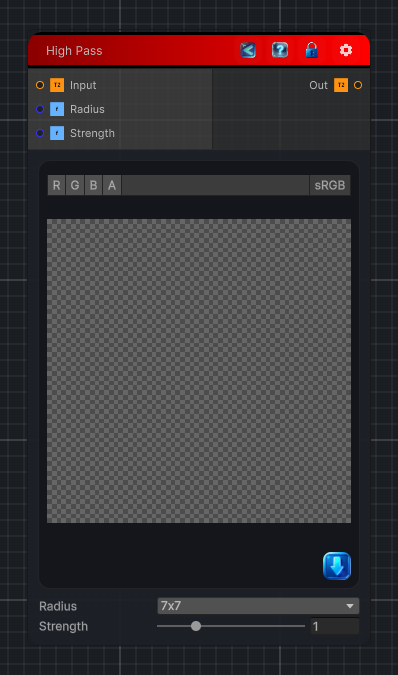

<link rel="stylesheet" href="../_assets/theme.css">

<button type="button" class="genesis-theme-toggle" data-genesis-theme-toggle aria-label="Toggle theme">Dark</button>

---
category: "Filters/Enhance"
---

# High Pass

> High Pass detail enhancement. Computes a low-pass (box-blurred) version of the input, extracts the high-frequency detail as the difference between the original and the blur, then adds that detail back scaled by Strength to enhance fine details (unsharp masking). Radius controls the size of the details boosted; Strength controls how strongly they are amplified. Alpha is taken from the input and is not modified.

## Description

High Pass detail enhancement. Computes a low-pass (box-blurred) version of the input, extracts the high-frequency detail as the difference between the original and the blur, then adds that detail back scaled by Strength to enhance fine details (unsharp masking). Radius controls the size of the details boosted; Strength controls how strongly they are amplified. Alpha is taken from the input and is not modified.

## Inputs

| Name | Type | Description |
|------|------|-------------|

## Outputs

| Name | Type |
|------|------|

## Parameters

| Setting | Type | Default | Description |
|---------|------|---------|-------------|
| Radius | int | 3 | Controls the radius. |
| Strength | Range | 1 | Controls the strength. |

## See Also

- [Back to High Pass](./filters-index.md)
